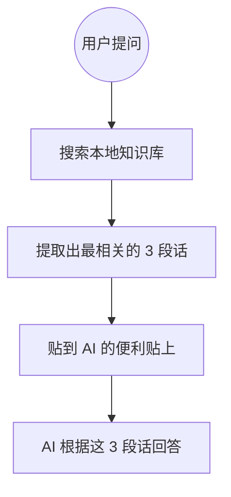

## 前言

最近你可能听过这样的话：“某某模型支持 1M 上下文！”或者“DeepSeek 升级了 128K 窗口！”

这些听起来很高大上的数字，到底决定了 AI 的哪些“超能力”？为什么说它是衡量 AI 好坏的核心指标？本文带你一文读懂。

---

## 1. 核心类比：短期记忆与便利贴

想象一下，你正在和一个超级聪明的教授（AI）促膝长谈。

### 上下文窗口 = 教授手里的便利贴
教授虽然聪明绝顶，但他有一个怪毛病：**他在交谈中唯一能记住的信息，就是这张便利贴上写的内容。**

*   **窗口小 (如 4K)**：便利贴只有巴掌大。你和他聊了 10 分钟，他之前的记忆就开始被擦掉，于是他开始“前言不搭后语”。
*   **窗口大 (如 128K)**：便利贴像一卷长长的卫生纸。你可以把整本《红楼梦》抄在上面递给他，他能瞬间看完并告诉你林黛玉一共哭了几次。

---

## 2. 什么是 Token？（记数单位）

上下文窗口的大小通常不是按“字数”计量的，而是按 **Token**。

*   **简单理解**：一个 Token 大约等于 0.75 个英文单词，或者 0.5 到 2 个汉字（取决于具体的模型编码）。
*   **计算公式**：输入给 AI 的问题 + AI 给你的回答 = **总消耗 Token**。

如果你的“便利贴”额度用满了，新写上去的内容就会把最旧的内容顶掉。

---

## 3. 为什么窗口大小至关重要？

| 窗口级别 | 典型Token数 | 能做什么？ |
| :--- | :--- | :--- |
| **入门级** | 4K - 8K | 简单的单次问答，写个短邮件。 |
| **进阶级** | 32K - 64K | 读一个复杂的 PDF 文档，分析一份万字报告。 |
| **专业级** | 128K+ | 读完一套完整的代码库，分析几十篇学术论文。 |
| **超长级** | 1M+ | 往里面扔一整季的电视剧剧本，或者长达数小时的会议录音。 |

---

## 4. 逻辑架构图：RAG 又是干嘛的？

当你发现 AI 的“便利贴”还是不够大，或者太贵了（Token 是要钱的），人类工程学就发明了 **RAG（检索增强生成）**。

**RAG 的本质：** 不让你把整本书给 AI 看，而是先把书存在图书馆（数据库），提问时，我帮你翻开最重要的那几页，贴在 AI 的面前。

---

## 5. 常见问题 FAQ

| 问题 | 解答 |
| :--- | :--- |
| **窗口越大 AI 越聪明吗？** | 不一定。有些模型会有“大海捞针”问题（Lost in the Middle），虽然看了很多，但中间的信息它会忽略。 |
| **我是不是该无脑选最大窗口的模型？** | 没必要。大窗口意味着更长的推理时间和更高的运行成本。杀鸡焉用宰牛刀。 |
| **为什么 AI 聊一会儿就开始胡说八道？** | 很有可能是因为对话太长，超出了他的上下文窗口，他把你的核心需求指令给“忘”了。 |

---

## 6. 小结

*   **上下文窗口是 AI 的“瞬时视角”**。
*   它决定了 AI 能在单次任务中处理的信息浓度。
*   掌握了 Token 和窗口的概念，你就能更精准地指挥 AI，避免“机对机”尴尬。

下次再选 AI 模型，记得先看它的“便利贴”够不够大！

---
本文由 ShenJinran 著作，转载请注明出处
