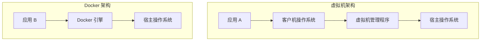

## 前言

如果你问近十年互联网后端最伟大的发明是什么，**Docker（容器）** 绝对榜上有名。很多人初学者会把容器当成“轻量级虚拟机”来理解，虽然直观，但却忽略了它最核心的革命性意义。本文将用最通俗的语言，带你彻底搞懂 Docker 到底是什么。

---

## 1. 核心类比：海运集装箱

在集装箱发明之前，码头搬运工需要面对各种奇形怪状的货物：钢琴、木材、布料、咸鱼……每种货物的装载方式都不一样，搬运效率极低，而且还容易互相污染。

> **Docker 就是码头上的标准集装箱。**

*   **隔离性**：你的代码（咸鱼）和我的代码（钢琴）都装在各自的箱子里，互不干扰。
*   **标准化**：只要是集装箱，不管里面装的是什么，吊车（操作系统）都能用同样的方式搬运。
*   **便携性**：箱子在上海港（开发环境）能跑，运到纽约港（生产环境）也一定能跑。

---

## 2. 容器 vs 虚拟机：本质区别

虽然它们都能实现环境隔离，但底层逻辑完全不同：

| 特性 | 虚拟机 (Virtual Machine) | Docker 容器 (Container) |
| :--- | :--- | :--- |
| **底层系统** | 每个虚拟机都有一个完整的 OS | 共享主机的操作系统内核 |
| **启动速度** | 分钟级（需要引导系统） | 秒级（就是一个进程） |
| **资源占用** | 很大（至少 GB 级内存） | 极小（通常 MB 级） |
| **隔离级别** | 硬件级隔离（安全性更高） | 进程级隔离 |
| **类比** | 像盖一座新别墅（带地基、水电） | 像租一个公寓间（共享地基、电梯） |

### 逻辑结构图

---

## 3. 核心三要素：镜像、容器、仓库

搞懂这三个词，你就搞懂了 Docker 的操作逻辑：

1.  **镜像 (Image)**：相当于“软件安装包”或者是“游戏的光盘”。它是只读的，包含了运行程序所需的所有代码、库和环境配置。
2.  **容器 (Container)**：镜像运行起来之后的“实例”。就像安装好的软件，你可以启动、停止、删掉它。
3.  **仓库 (Repository)**：存放镜像的地方。最著名的是 [Docker Hub](https://hub.docker.com/)。

---

## 4. 为什么 Docker 这么火？

*   **“在我电脑上明明能跑！”**：解决了环境配置不一致的千古难题。
*   **微服务架构的基石**：你可以轻松地起 100 个小型服务，而不用开 100 台虚拟机。
*   **持续集成与交付 (CI/CD)**：代码一旦打包成镜像，在任何环境都有一致的行为。

---

## 5. 常见问题 FAQ

| 问题 | 解答 |
| :--- | :--- |
| **Docker 是不是只适合程序员？** | 不是的。对于运维、数据分析师（配置复杂的 Python 环境）甚至普通用户（运行私有云盘、Home Assistant）都非常有用。 |
| **Docker 容器里的数据会丢吗？** | 默认情况下，容器删掉后内部数据会消失。所以我们需要使用 **数据卷 (Volume)** 把重要数据映射到宿主机上。 |
| **Windows 能跑 Docker 吗？** | 可以。Docker Desktop 会利用 WSL2（Windows 的 Linux 子系统）来实现，现在体验已经非常好了。 |

---

## 6. 小结

Docker 不是魔术，它只是通过**巧妙的层级文件系统**和**操作系统的进程隔离技术**，把我们的开发环境变成了一个个标准化的“集装箱”。

如果你还没开始学习 Docker，那么现在就是最好的时机！

---
本文由 ShenJinran 著作，转载请注明出处
