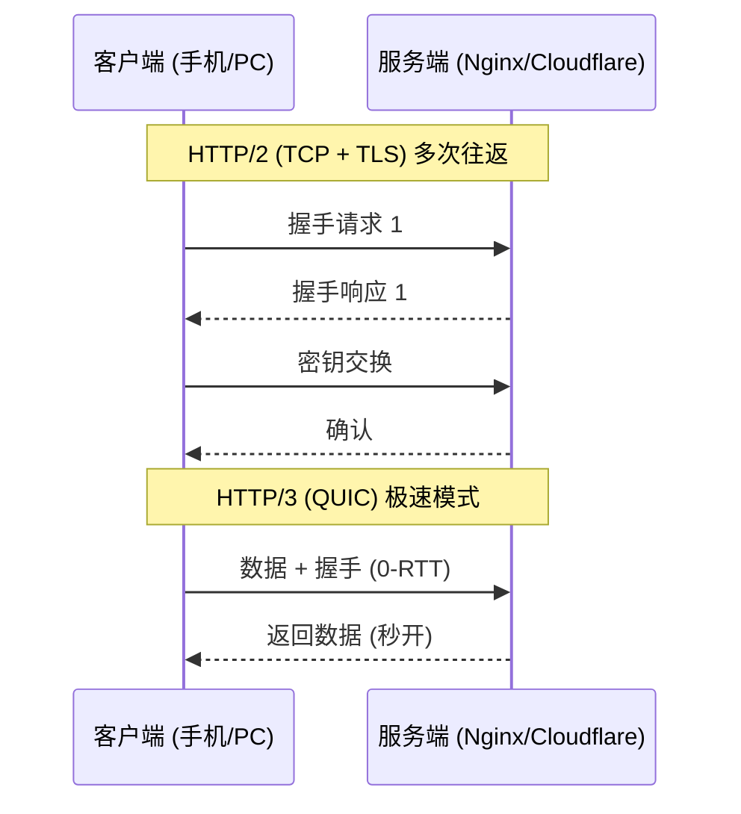

## 前言

你有没有发现，现在的网页打开速度比五年前快了不只一个量级？哪怕是在电梯里、地铁中这种网络不稳的环境下，短视频依然刷得飞起。

这背后不仅是硬件的功劳，更是一场潜伏在互联网最底层的革命——**HTTP/3 协议**。

---

## 1. 核心问题：为什么之前的协议慢？

在 HTTP/3 之前，互联网主要跑在 **TCP 协议**上。它虽然稳如老狗，但有一个致命缺点：**队头阻塞 (Head-of-Line Blocking)**。

### 形象类比：单车道的收费站
想象你正在通过一个只有一条道的收费站，前面有三辆货车：一辆运煤（HTML）、一辆运木头（CSS）、一辆运咸鱼（JS）。
*   **问题**：如果最前面运煤的车胎爆了（丢包），哪怕后面的木头和咸鱼已经装好了，它们也得死死等在后面，直到运煤车修好。
*   **现状**：HTTP/1.1 和 HTTP/2 在遇到网络波动（丢包）时，都会因为这个“收费站”卡死整个连接。

---

## 2. HTTP/3 的大杀器：QUIC 协议

HTTP/3 彻底抛弃了慢吞吞的 TCP，拥抱了自由奔放的 **UDP**，并在其之上构建了一套全新的逻辑——**QUIC**。

### 革命性改进：多车道高速公路
QUIC 就好比把原来的单车道收费站拆了，变身成了**多车道并行公路**。

| 特性 | HTTP/2 (基于 TCP) | HTTP/3 (基于 QUIC/UDP) |
| :--- | :--- | :--- |
| **底层核心** | TCP（必须按序交付） | QUIC（独立流交付） |
| **握手时间** | 慢（需要 TCP 三次握手 + TLS 握手） | 极快（通常 0-RTT 或 1-RTT） |
| **丢包响应** | 单个包丢了，全连接阻塞 | 单个流丢了，其它流照样跑 |
| **网络切换** | 掉线需重连（IP 变了就断） | 无感切换（基于连接 ID 而非 IP） |

---

## 3. 逻辑示意图

---

## 4. 为什么你会感受到快？

1.  **“秒开”不是梦**：QUIC 允许你在发第一个包的时候就带上数据，省去了漫长的握手等待。
2.  **移动场景王者**：你在地铁里，手机基站从 A 站切到 B 站，IP 地址变了。如果是 HTTP/2，TCP 连接必断；但在 HTTP/3 中，因为它认的是你的“连接 ID”，所以视频完全不会卡顿。
3.  **弱网环境下更硬核**：在丢包率高的 Wi-Fi 环境下，HTTP/3 的并流特性让它的抗干扰能力提升了数倍。

---

## 5. 常见问题 FAQ

| 问题 | 解答 |
| :--- | :--- |
| **我需要为了 HTTP/3 改代码吗？** | 不需要。浏览器（Chrome/Edge/Safari）和服务器（Nginx/Caddy）会自动完成协商。只要你开启了开关，代码逻辑保持不变。 |
| **UDP 不是不可靠吗？丢包怎么办？** | 虽然底层是 UDP，但 QUIC 在应用层自己实现了一套完美的“重传”和“流控制”机制，它甚至比 TCP 更懂怎么补发数据。 |
| **为什么还有很多站没用 HTTP/3？** | 因为有些防火墙（GFW 等）会拦截 UDP 流量，或者老旧设备的兼容性问题。但目前全球流量过半已经开始拥抱 QUIC 了。 |

---

## 6. 小结

HTTP/3 是一次“推倒重来”的底层重构。它不再执着于完美的顺序，而是追求**极速的响应**和**极强的韧性**。

**未来已来，你的网络协议准备好了吗？**

---
本文由 ShenJinran 著作，转载请注明出处
