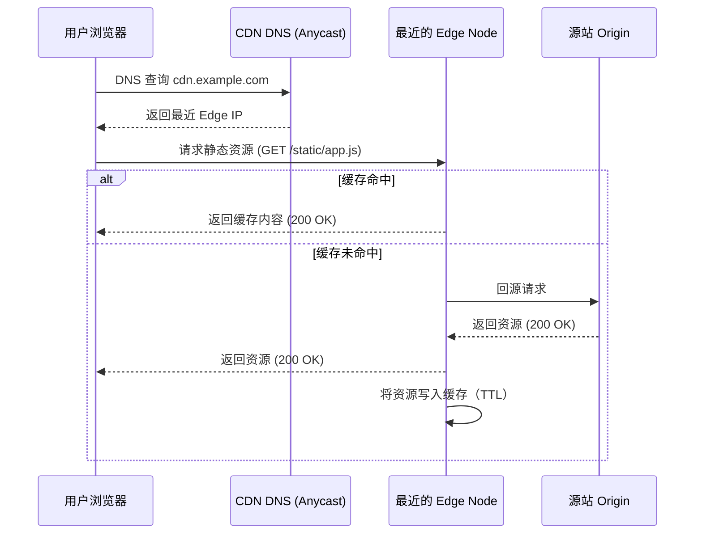

## 前言

在如今的互联网时代，用户对页面加载速度的期待已经从“能用”提升到“秒开”。**内容分发网络（CDN）** 正是帮助网站实现高速、可靠交付的关键技术。本文将从 **概念、工作原理、选型要点以及实战案例** 四个维度，系统性地为大家拆解 CDN，帮助你在项目中快速落地。

---

## 1. CDN 是什么？

> **内容分发网络（Content Delivery Network）**，是一套遍布全球的缓存服务器（Edge Nodes），通过最近的节点把源站资源（HTML、CSS、JS、图片、视频等）复制并分发给终端用户。

### CDN 的核心价值

| 价值点 | 解释 |
|--------|------|
| **降低延迟** | 用户请求会被路由到距离最近的边缘节点，显著缩短 RTT（往返时延）。 |
| **提升并发** | 边缘节点承担大量请求，降低源站的并发压力，防止瞬时流量冲击导致宕机。 |
| **优化带宽** | 通过缓存减少对源站的回源请求，节省带宽成本。 |
| **提升安全** | 大多数 CDN 提供 DDoS 防护、WAF（Web Application Firewall）等安全层。 |
| **全球可用** | 跨地域的业务无需单独部署多套基础设施，即可实现全球覆盖。 |

---

## 2. CDN 的工作原理

下面用一个简化的时序图来说明用户请求是如何在 CDN 中完成的：



### 关键概念

| 名称 | 含义 |
|------|------|
| **Edge Node（边缘节点）** | CDN 网络中最靠近用户的缓存服务器。 |
| **Origin（源站）** | 存放原始资源的服务器，通常是你的 Web 服务器或对象存储。 |
| **TTL（Time To Live）** | 缓存有效时间，决定资源多久会重新回源验证。 |
| **回源（Origin Pull）** | 当 Edge 节点没有缓存时，请求 Origin 拉取资源的过程。 |
| **预热（Prefetch / Push）** | 主动将热点资源推送到 Edge 节点，以避免首次访问时的回源延迟。 |

---

## 3. 选型要点与常见供应商对比

| 维度 | 阿里云 CDN | 腾讯云 CDN | Cloudflare | Fastly |
|------|-----------|------------|------------|--------|
| **节点覆盖** | 120+ 全球节点（亚洲占比最高） | 100+ 全球节点 | 200+ 超大覆盖，尤其在欧美 | 150+ 高性能节点 |
| **价格模型** | 按流量 + 按请求计费 | 按流量计费 | 免费套餐（Basic），付费套餐（Pro/Business） | 按请求计费（更细粒度） |
| **自定义规则** | 支持缓存规则、Header 重写、Referer 防盗链 | 支持自定义缓存键、回源策略 | 强大的 Page Rules、Workers 脚本 | 强大的 VCL 配置 |
| **安全防护** | DDoS、WAF、Bot 管理 | DDoS、WAF、CC 防护 | DDoS 防护、SSL/TLS、Bot Fight Mode | 高级 WAF、实时日志 |
| **实时统计** | 控制台提供流量/命中率实时图表 | 实时监控仪表盘 | Dashboard 实时图表 | API 实时监控 |

> **选型建议**  
> - **国内业务**：优先考虑阿里云或腾讯云，节点分布更贴近国内用户。  
> - **海外 SaaS**：推荐 Cloudflare（全球节点密度高）或 Fastly（低延迟、灵活配置）。  
> - **安全需求**：如果业务对 WAF 有严格要求，Fastly + AWS Shield 或阿里云 WAF 是可靠组合。  

---

## 4. 如何在 Hexo 项目中接入 CDN？

下面以 **阿里云 CDN** 为例，演示完整的接入流程。其它供应商的步骤类似，只是控制台和 DNS 设置略有差异。

### 4.1 创建 CDN 加速域名

1. 登录阿里云控制台 → **网络 CDN** → **域名管理** → **添加加速域名**。  
2. 填写业务域名（如 `static.example.com`），选择 **加速区域**（全加速/中国大陆/境外），确定。  

### 4.2 配置回源与缓存规则

| 参数 | 推荐值 |
|------|--------|
| **回源方式** | **回源至源站（Origin Pull）** |
| **缓存时间（TTL）** | 1 天（静态资源），若资源经常更新可使用 **Cache-Control: max‑age** 控制。 |
| **强制 HTTPS** | **开启**，使用 CDN 提供的免费证书或自带证书。 |
| **防盗链** | 根据业务需求开启 Referer、签名防盗链。 |

### 4.3 DNS 解析绑定

在你的 DNS 服务商（阿里云 DNS、腾讯云 DNS、Cloudflare 等）中，将 `static.example.com` **CNAME** 指向 CDN 控制台提供的加速域名（如 `xxxxxx.accelerate.aliyuncs.com`）。

```text
static.example.com. 300 IN CNAME xxxx.accelerate.aliyuncs.com.
```


## 5. 实战案例：电商网站的 CDN 优化

| 场景 | 目标 | 实施措施 | 成果 |
|------|------|----------|------|
| 首页图片（平均 1.5 MB） | 页面首屏 < 2 s | - 使用 **WebP** 规格<br>- 设置 **TTL=7 天**<br>- 开启 **图片压缩**（CDN 自动） | 首屏加载时间从 4.2 s 降至 1.8 s，云宽带成本下降 38% |
| 商品详情 JS 包（2 MB） | 并发 1k QPS 时不掉线 | - 将 `app.js` 进行 **分块（Chunk）**<br>- 使用 **Cache-Control: immutable**<br>- 发起 **预热**（push）到热点节点 | 回源次数从 350 次/分钟 降至 12 次/分钟，峰值 QPS 稳定在 5k+ |
| 跨境登录页面（美国用户） | 延迟 < 100 ms | - 针对美国用户创建 **单独的加速区域**<br>- 使用 **HTTPS Keep‑Alive**<br>- 开启 **HTTP/2** | 平均 RTT 从 210 ms 降至 68 ms，转化率提升约 4.5% |

> **经验总结**  
> 1. **合理划分缓存粒度**：对不经常改动的资源（如字体、库文件）设长 TTL；对经常更新的资源使用版本号或 query string 强制刷新。  
> 2. **开启压缩**：CDN 支持 **Brotli**、**Gzip**，确保 `Accept‑Encoding` 被正确发送。  
> 3. **监控命中率**：通过 CDN 控制台或 API 获取 `Hit Rate`，低于 70% 时考虑 **预热**或 **调整缓存键**。  

---

## 6. 常见问题 FAQ

| 问题 | 解答 |
|------|------|
| **CDN 会不会影响 SEO？** | 正常情况下不会，搜索引擎会像普通静态资源一样抓取。确保返回 **200** 状态码并且 **canonical** 正确即可。 |
| **怎样避免缓存“脏数据”？** | 1️⃣ 给资源加上版本号（如 `app.v1.2.js`）<br>2️⃣ 使用 **Cache-Control: no‑cache** 或 **max‑age=0** 控制不缓存的接口<br>3️⃣ 对重要接口开启 **查询字符串缓存**（Cache‑Key 包含 query） |
| **CDN 费用怎么控制？** | - **结合业务峰值**选择合适的计费套餐<br>- **开启流量压缩**（图片、文字）<br>- **使用对象存储 + CDN**，避免直接回源直传产生高昂带宽 |
| **本地开发时不想走 CDN，怎么实现？** | 在 `hexo server` 时关闭 CDN filter（`cdn.enable: false`），或在本地 `hosts` 文件中把 `static.example.com` 指向 `127.0.0.1`。 |
| **CDN 与 Edge Function（如 Cloudflare Workers）能一起使用吗？** | 完全可以。先让 CDN 缓存静态资源，再用 Edge Function 处理动态业务或安全校验，二者互补提升整体性能。 |

---

## 7. 小结

- **CDN 是提升网站性能、降低成本、保障安全的关键设施**。  
- 通过 **合理的缓存策略、明确的回源规则和细致的监控**，可以让几乎所有类型的业务受益。  
- **选型** 时要基于业务地域分布、预算、功能需求进行综合评估。

本文由ZhouLirui著作，转载请注明出处
