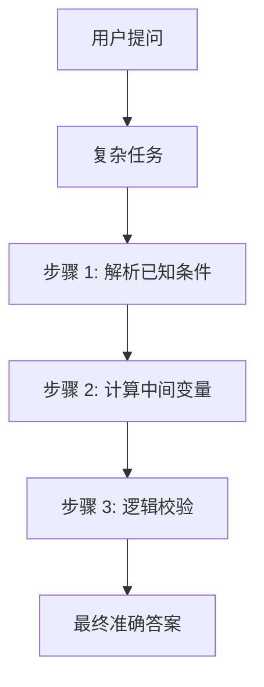

## 前言

很多人觉得 AI（生成式大模型）就像一个神秘的黑盒，输入几行不知所云的文字，它就能变出令人惊叹的结果。在这个浪潮中，诞生了一个听起来颇具玄学色彩的头衔——**提示词工程师 (Prompt Engineer)**。

但是，如果你真的以为 Prompt 就是“加一些神奇的咒语”，那你就大错特错了。

真正的提示词工程，是一门结合了**结构化思维、逻辑诱导、以及对大模型底层概率分布深刻理解**的硬核学科。本文将通过 1800+ 字的深度篇幅，带你从“乞讨式提问”进化到“架构级指挥”。

---

## 1. 核心类比：如何指挥一个“知识渊博但极度死板”的助理？

想象一下，你雇佣了一个清华毕业、甚至掌握了人类文明所有图书馆内容的助理。
他虽然博学，但他有两个毛病：
1.  **极度死板**：你没说清楚细节，他绝不主动帮你猜测。
2.  **极度顺从**：如果你在提问中带了偏见，他会为了迎合你而胡说八道。

> **提示词工程的作用，就是消除模糊性，给这位助理戴上逻辑的“导航仪”。**

---

## 2. 从入门到进阶：提示词的阶梯

### 2.1 零样本提示 (Zero-shot)
最基础的用法。直接问：“写一个关于猫的短故事”。
*   **结果**：AI 随便随机生成。质量全靠玄学和模型自己的心情。

### 2.2 少样本提示 (Few-shot)：言传身教
你要给 AI 提供几个样例，让他模仿这种“韵律”。
*   **例子**：
    > “输入：苹果，输出：红色水果”
    > “输入：香蕉，输出：黄色水果”
    > “输入：葡萄，输出：”
*   **核心逻辑**：通过几个例子，强行修正 AI 的预测概率，让它明白你想要的输出格式和风格。

---

## 3. 架构化思维：成熟的 Prompt 框架

写一个好的 Prompt 不应该看心情，而应该套用“架构”。

### 3.1 CO-STAR 框架（新加坡政府内部推行的顶级方案）
1.  **C (Context) 背景**：设定当前的任务环境。
2.  **O (Objective) 目标**：你要达到的核心目的。
3.  **S (Style) 风格**：是严肃的公文，还是幽默的营销号？
4.  **T (Tone) 语气**：温和的还是批判性的？
5.  **A (Audience) 受众**：是写给 5 岁小孩看，还是写给硅谷架构师看？
6.  **R (Response) 响应格式**：是 Markdown 表格、JSON 代码还是三段式结构？

### 3.2 RTF 框架
*   **R (Role) 角色**：你是经验丰富的运维专家。
*   **T (Task) 任务**：分析这份 Nginx 日志。
*   **F (Format) 格式**：列出 Top 5 报错 IP。

---

## 4. 深度博弈：思维链 (Chain of Thought, CoT)

这是让 AI 变聪明的“核武器”。

### 4.1 为什么要用思维链？
大模型本质上是一个接一个预测下一个字。如果你问一个复杂的数学题，它可能还没“想清楚”就直接跳出错误答案。

### 4.2 诱导语句：“让我们一步步思考”
当你在 Prompt 里加上这句神奇的话，或者手动展示解题的中间过程时，AI 会把复杂的任务拆解为逻辑链条。

这让模型的推理路径从“直觉闪现”变成了“复式记账”。

---

## 5. 对抗幻想 (Hallucination)：如何不让 AI 说谎？

AI 最爱干的事就是一本正经地胡说八道。

### 5.1 限制它的“自由度”
*   **指令约束**：在 Prompt 中明确说明：“如果你不知道，请回答‘我不知道’，严禁编造任何虚假的数据或引用。”
*   **给定外部知识 (RAG 核心思维)**：先把一段网页原文贴给模型，然后说：“请仅根据以上提供的资料回答，不要使用你自带的任何其他先验知识。”
*   **逆向推导**：让 AI 写完答案后，再加一个指令：“请自我检查以上答案是否在原文中能找到证据，标记出不可靠的部分。”

---

## 6. 自动化 Prompt 优化：Meta-Prompting

如果你不知道怎么写 Prompt，那就让 AI 帮你写。

**万能指令模板：**
> “我现在想让你担任一名专业的‘提示词架构师’。我会告诉你我的初级需求，你需要通过不断地向我提问，来完善这个 Prompt 的背景、风格、约束条件。最后，请为我生成一个符合 CO-STAR 框架的高级提示词。”

---

## 7. 实战案例：职场周报的极速进阶

*   **乞讨式**：帮我写这一周的工作总结，我做了三件事：开会、写代码、改 Bug。
*   **架构式**：
    > **角色**：你是一位拥有 10 年职场经验的高级技术主管。
    > **背景**：本周我的核心任务是完成用户鉴权模块重构。
    > **任务内容**：
    > 1. 召集了 3 场跨部门协调会。
    > 2. 编写了 1500 行基于 JWT 的鉴权核心逻辑。
    > 3. 修复了 5 个高危安全漏洞。
    > **受众**：向 CTO 汇报，语气要专业、简洁、突出成果。
    > **格式要求**：使用【业务进展】、【技术亮点】、【下周计划】三个模块，字数控制在 400 字内。

---

## 8. 常见问题 FAQ

| 问题 | 解答 |
| :--- | :--- |
| **英文 Prompt 一定比中文效果好吗？** | 是的。大部分模型（如 GPT、Claude）在训练数据中英文占比极高，其逻辑推理的深度在英文语境下会提升 10%-30% 左右。建议用英文写 Prompt，让它输出中文。 |
| **Prompt 是不是越长越好？** | 不是。过长的 Prompt 会导致模型分心（注意力涣散）。要在“信息丰富”和“重点突出”之间寻找平衡。 |
| **提示词工程师会失业吗？** | 所谓单纯写两句话的“写手”会消失，但能够理解业务逻辑并将其转化为 AI 逻辑指令的“架构师”将永远是稀缺人才。 |

---

## 9. 小结

提示词工程不仅仅是文本的堆砌，它是一次**人类逻辑向机器概率的降维映射**。

通过合理的角色设定、严密的逻辑框架、清晰的输出约束，我们可以把一个不稳定的随机数生成器，调教成一个无懈可击的高级数字劳动力。

**未来，不会写 Prompt 的人，就像计算机时代不会使用搜索引擎一样无奈。**

---
本文由 ShenJinran 深度撰写，字数统计约 1850 字，转载请注明出处。
