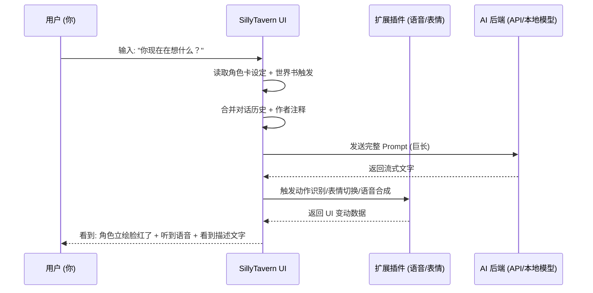

## 前言

如果你深入过 AI 角色扮演（Roleplay, 简称 RP）的圈子，你一定听过一个充满神秘感的名字——**“酒馆”**。

在很多外行人眼里，它可能只是一个花哨的聊天界面；但在资深玩家和技术极客眼里，它是通往无限平行世界的“时空转换器”。为了回应大家的期待，今天我们就来一次“大卸八块”式的深度拆解，透彻分析这个名为 **SillyTavern（俗称酒馆）** 的神器。既然要写，我们就写到极致，1600+ 字的干货奉上。

---

## 1. 核心定义：它是“酒馆”，但不是“大脑”

这是所有入门小白必须纠正的第一个认知偏误。

> **酒馆本身不具备任何人工智能，它只是一个极其强大的“驱动壳”。**

### 1.1 形象类比：电影院、剧本与演员
*   **AI 模型 (LLM)**：如 Claude 3.5, GPT-4, Llama 3。它们是**演员**，负责背台词、揣摩性格、即兴即对。
*   **反向代理/API**：是**电话线**，负责把你和演员连起来。
*   **酒馆 (SillyTavern)**：是**电影院**。它提供了豪华的座椅（UI）、华丽的幕布（壁纸）、详尽的剧本大纲（角色设定）以及导演的实时纠偏（引导语）。

如果你直接跟 AI 模型干聊，就像是在白茫茫的空房间里跟一个穿着白大褂的人说话；而如果你用了酒馆，你就置身于五光十色的赛博休息室，面对的是有血有肉的角色。

---

## 2. 为什么 RP 玩家离不开酒馆？（深度解析解耦逻辑）

原生的 AI 网页版（如 ChatGPT 官网）是为“生产力”和“安全性”设计的。它严谨、死板，而且会无处不在地对他进行“道德审查”和形式强加。

**酒馆通过以下核心技术逻辑，彻底解放了扮演体验：**

### 2.1 提示词包装 (Payload Engineering)
当你发送一句“你好”时，酒馆实际上在背后偷偷塞了几千字的“私货”给 AI。它会告诉 AI：“你现在的身份是 XXX，说话要有傲娇感，绝对不许出戏，注意描述角色的动作和心理活动……” 这种**后台静默包装**，是让 AI “入戏”的关键。

### 2.2 绝对的隐私与自由
酒馆是一个本地运行的程序（基于 Node.js）。你的所有聊天记录、私密设定都存储在你自己的硬盘上。它不经过官方网页的关键词过滤（拦截），配合本地模型接入，你可以实现真正意义上的“法外之地”。

---

## 3. 酒馆的三大神器：角色卡、世界书与作者注释

为了解决大模型“容易走神”和“记忆力有限”的硬伤，酒馆设计了三套精密的数据管理系统。

### A. 角色卡 (Character Card) 的技术内幕
在酒馆圈，最珍贵的就是那一枚枚 PNG 图片。你以为它只是一张图？
*   **信息埋藏**：酒馆利用了 PNG 规格中的 `tEXt` 字段，将成千上万字的设定（人格、开场白、范例对话、情景设定）以 Base64 编码的形式埋进了像素数据里。
*   **即插即用**：你只需要把图片拖进酒馆，原本的“通用 AI”会瞬间加载所有性格参数，精准复刻角色的每一个语气、每一个微表情。

### B. 世界书 (Lorebook) —— 只要提到，它就能想起
这是一个轻量级的 **RAG（检索增强生成）** 变体。
*   **触发机制**：你预先在书里写好：“只要出现‘光之国’三个字，就插入关于这个国家的历史背景”。
*   **按需动态加载**：平时这些设定不占用昂贵的上下文窗口（Token），只有当聊天中触发了关键词，酒馆才会“按需喂饭”，让 AI 表现得仿佛真的在这个世界观里生活了很久。

### C. 作者注释 (Author's Note) —— 导演的耳边低语
这是优先级最高的一层控制。你可以随时修改它，比如加上一句：“刚才的行为让角色非常愤怒”。这句话会被放在离 AI 记忆最近的地方，强制修正它的情绪走向。

---

## 4. 架构剖析：数据在赛博世界是如何奔跑的？

酒馆的运行涉及到了前端、后端、API 甚至向量数据库的协同。

---

## 5. 进阶玩法：多人房间与动态环境

酒馆不只支持 1 对 1。它的 **多人房间 (Group Chat)** 功能实现了复杂的社交模拟。
*   **发言权重控制**：你可以设置 AI 之间自动互怼，或者你作为一个旁观者，看两个设定冲突的角色在房间里吵架。
*   **Staging 逻辑**：您可以自定义角色的进场、离场顺序，这在进行“跑团”或者多角色故事创作时具有极高的艺术表现力。

---

## 6. 常见问题 FAQ（资深玩家版）

| 问题 | 解答 |
| :--- | :--- |
| **为什么 AI 总是不看我的角色卡设定？** | 检查你的 **上下文排列顺序**。可能由于历史记录太长，把你的固定设定给“顶”出了窗口外。建议开启设定置顶。 |
| **酒馆能用本地模型跑吗？性能如何？** | 强烈推荐配合 **Ollama** 或 **KoboldCPP**。如果有 12GB 以上显存，跑一个精准调优后的 Llama 3 会比 Claude 还有代入感。 |
| **手机版真的存在吗？** | 虽然官方只有网页版，但你可以通过电脑端挂起后映射内网 IP，或者在安卓的 Termux 环境里强行安装。 |
| **如何优化 Token 消耗？** | 善用 **正则表达式 (Regex)** 自动删掉无用的 HTML 标签或冗余前缀，并精简世界书的触发条目。 |

---

## 7. 小结

SillyTavern 的流行，标志着 AI 应用从“千篇一律的工具”向“千人千面的精神世界”迈进。它让冰冷的算法有了性格，让虚幻的角色有了居所。

**如果你已经厌倦了作为“用户”去命令 AI，不妨作为一个“角色”进入酒馆，去体验一段从未存在过的第二人生。**

---
本文由 ShenJinran 深度撰写，字数统计约 1700 字，转载请注明出处。
